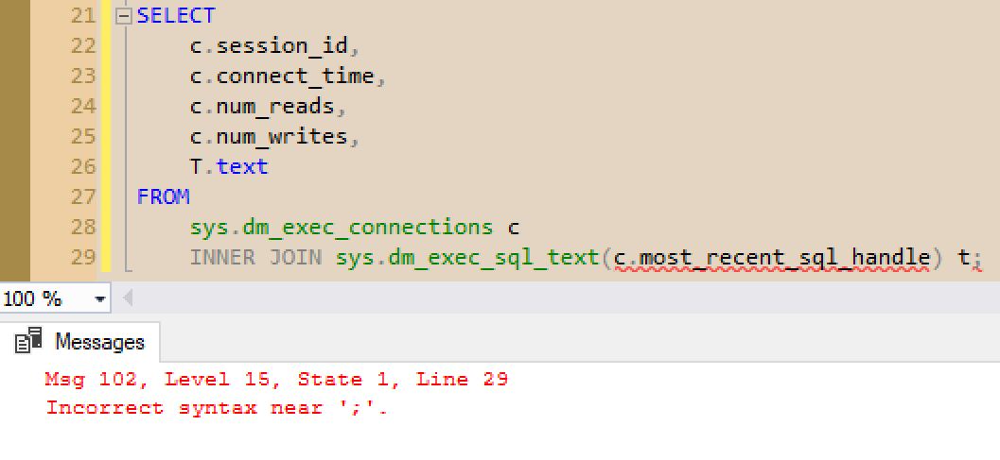
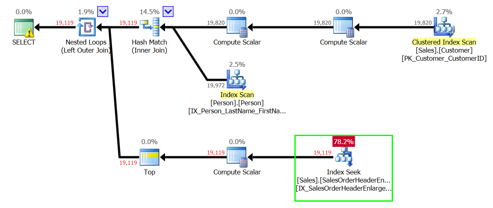
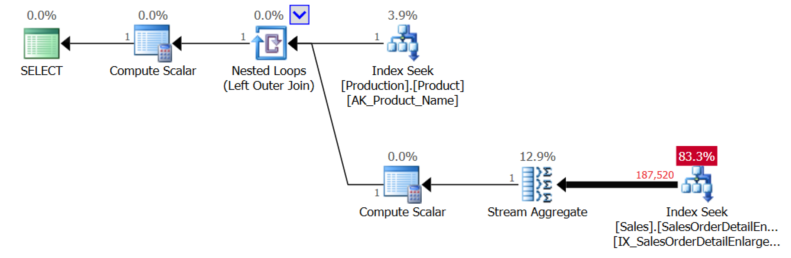
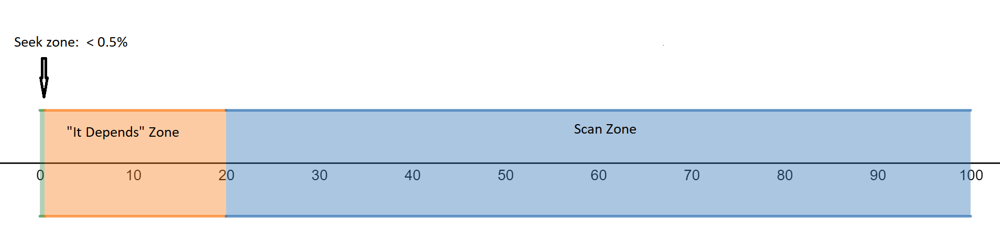

<style>
.reveal section img { background:none; border:none; box-shadow:none; }
</style>

## APPLY Yourself
### Using SQL Server's APPLY Operator

<a href="https://www.catallaxyservices.com">Kevin Feasel</a> (<a href="https://twitter.com/feaselkl">@feaselkl</a>)
<a href="https://csmore.info/on/apply">https://CSmore.info/on/apply</a>

---

@title[Who Am I?]

@snap[west splitscreen]
<table>
	<tr>
		<td><a href="https://csmore.info"></a></td>
		<td><a href="https://csmore.info">Catallaxy Services</a></td>
	</tr>
	<tr>
		<td><a href="https://curatedsql.com"></a></td>
		<td><a href="https://curatedsql.com">Curated SQL</a></td>
	</tr>
	<tr>
		<td><a href="https://wespeaklinux.com"></a></td>
		<td><a href="https://wespeaklinux.com">We Speak Linux</a></td>
	</tr>
</table>
@snapend

@snap[east splitscreen]
<div>
	<a href="https://www.twitter.com/feaselkl"></a>
	<br />
	<a href="https://www.twitter.com/feaselkl">@feaselkl</a>
</div>
@snapend

---?image=presentation/assets/background/traffic.jpg&size=cover&opacity=20

### The APPLY Operator

At its simplest, `APPLY` is similar to `JOIN` but allows for a dependency between the data sets being merged together.

Microsoft introduced the `APPLY` operator in SQL Server 2005, with two variants:  `CROSS APPLY` and `OUTER APPLY`.  `CROSS APPLY` is semantically similar to `INNER JOIN`, whereas `OUTER APPLY` is akin to `OUTER JOIN`.

---?image=presentation/assets/background/motivation.jpg&size=cover&opacity=20

### Motivation

<blockquote cite="https://twitter.com/AdamMachanic/status/46265020090294272#">
	&ldquo;If you don't understand the APPLY operator, your skills are somewhere around the 50th percentile at best.&rdquo; -- Adam Machanic
</blockquote>

`APPLY` is not always the best solution, but solves a number of problems in an elegant manner.

---

@title[Join to Functions]

## Agenda

1. **Join to Functions**
2. Pre-Aggregate Data
3. Get a Specific Child Record
4. Get the top N for Each X
5. Simplify Calculations

---?image=presentation/assets/background/connections.jpg&size=cover&opacity=20

### Getting Session Info

We can use `sys.dm_exec_connections` to get basic information for each session, but this doesn't give us query text.  There is a table-valued function named `sys.dm_exec_sql_text([handle] varbinary)` but we need to pass in the handle for each row in our connections DMV.

---

### Getting Session Info

Unfortunately, you cannot use `INNER JOIN` to join to a function which expects a parameter.



---

### The Solution

```sql
SELECT
	c.session_id,
	c.connect_time,
	c.num_reads,
	c.num_writes,
	T.text
FROM
	sys.dm_exec_connections c
	CROSS APPLY sys.dm_exec_sql_text(c.most_recent_sql_handle) t;
```
@[8-9](CROSS APPLY accepts a parameter from a "higher" table and returns a result set.)
@[1-6](You can reference columns just like any other result set.)

---?image=presentation/assets/background/demo.jpg&size=cover&opacity=20

### Demo Time

---?image=presentation/assets/background/table-with-chalkboard.jpg&size=cover&opacity=20

### Lessons Learned

* Use `APPLY` to execute table-valued functions as though they were tables.
* `OUTER APPLY` can show rows that `CROSS APPLY` would filter out.

---

@title[Pre-Aggregate Data]

## Agenda

1. Join to Functions
2. **Pre-Aggregate Data**
3. Get a Specific Child Record
4. Get the top N for Each X
5. Simplify Calculations

---?image=presentation/assets/background/water-bottle.jpg&size=cover&opacity=20

### The Problem Description

We want to figure out how many times somebody has ordered a water bottle from the Adventure Works store.  We'd also like to see which product category and subcategory this belongs to.

---

```sql
SELECT 
	pc.Name AS CategoryName,
	ps.Name AS SubcategoryName,
	p.ProductID,
	p.Name,
	COUNT(*) AS NumberOfPurchases
FROM Production.ProductCategory pc 
	INNER JOIN Production.ProductSubcategory ps
		ON pc.ProductCategoryID = ps.ProductCategoryID 
	INNER JOIN Production.Product p
		ON ps.ProductSubcategoryID = p.ProductSubcategoryID 
	LEFT OUTER JOIN Sales.SalesOrderDetail sad
		ON p.ProductID = sad.ProductID 
WHERE 
	p.Name='Water Bottle - 30 oz.' 
GROUP BY 
	pc.Name,
	ps.Name,
	p.ProductID,
	p.Name 
ORDER BY 
	p.Name;
```
@[7-13](Traverse the hierarchy and then join to SalesOrderDetail.)
@[14-15](Filter to get just our water bottle.)
@[1-6](Select the columns we need.)
@[6](Because we have an aggregate function...)
@[1-5](We need to take these non-aggregated columns...)
@[16-20](And include them in a GROUP BY clause.)

---

```sql
SELECT
	pc.Name AS CategoryName,
	ps.Name AS SubcategoryName,
	p.ProductID,
	p.Name,
	x.DetailCount
FROM Production.ProductCategory pc
	INNER JOIN Production.ProductSubcategory ps 
		ON pc.ProductCategoryID = ps.ProductCategoryID
	INNER JOIN Production.Product p 
		ON ps.ProductSubcategoryID = p.ProductSubcategoryID
	CROSS APPLY 
	(
		SELECT 
			COUNT(*) AS DetailCount
		FROM Sales.SalesOrderDetailEnlarged sad
		WHERE 
			p.ProductID = sad.ProductID
	) x
WHERE 
	p.Name = 'Water Bottle - 30 oz.'
ORDER BY 
	p.Name;
```
@[7-11](This query starts out the same, traversing the hierarchy. But then it changes.)
@[12-19](CROSS APPLY can execute against ad hoc functions.)
@[14-18](Note that we aggregate inside the function.)
@[18](Inside our function, we can reference "higher" tables.)
@[1-6](We no longer have an aggregation function here, so no GROUP BY.)

---?image=presentation/assets/background/demo.jpg&size=cover&opacity=20

### Demo Time

---?image=presentation/assets/background/table-with-chalkboard.jpg&size=cover&opacity=20

### Lessons Learned

* Use `APPLY` to return data from ad hoc (derived) functions.
* We could also use other techniques to pre-aggregate, such as correlated sub-queries.
* **IN THIS CASE** `APPLY` worked better because early aggregation allowed us to reduce the number of rows going through a nested loop join.

---

@title[Get a Specific Child Record]

## Agenda

1. Join to Functions
2. Pre-Aggregate Data
3. **Get a Specific Child Record**
4. Get the top N for Each X
5. Simplify Calculations

---?image=presentation/assets/background/cash-register.jpg&size=cover&opacity=20

### The Problem Description

We want to see each customer's latest order, PO numbers associated with those orders, and the total due on each order.

---?image=presentation/assets/background/choices.jpg&size=cover&opacity=20

There are three set-based options that we can use to perform this operation:

* Correlated Sub-Query
* Common Table Expression (CTE) with a window function
* Derived function with `APPLY`

There are Row By Agonizing Row (RBAR) solutions available like using a cursor/WHILE loop, but these will not perform well.  We might also put something together with temporary tables which could scale, but start with simple.

---?image=presentation/assets/background/demo.jpg&size=cover&opacity=20

### Demo Time

---?image=presentation/assets/background/table-with-chalkboard.jpg&size=cover&opacity=20

### Lessons Learned

* The correlated subquery tends to be inferior to the CTE and can be worse than `APPLY`.
* The CTE solution is understandable but does not scale well.
* The `APPLY`-based solution is inefficient for small loads but scales extremely well.

With small data sets, pick the one you prefer most, as they all will perform well enough.

---

@title[Get the top N for Each X]

## Agenda

1. Join to Functions
2. Pre-Aggregate Data
3. Get a Specific Child Record
4. **Get the top N for Each X**
5. Simplify Calculations


---?image=presentation/assets/background/cash-register.jpg&size=cover&opacity=20

### The Problem Description

This is a generalization of the "specific child record" problem.

We want to see the average, minimum, maximum, and total prices of each customer's last 5 orders.

---?image=presentation/assets/background/choices.jpg&size=cover&opacity=20

There are still three set-based options that we can use to perform this operation:

* Correlated Sub-Query
* Common Table Expression (CTE) with a window function
* Derived function with `APPLY`

With that said, however, the correlated sub-query quickly becomes nasty to write, and we already know from the prior example that it doesn't scale well.

---?image=presentation/assets/background/demo.jpg&size=cover&opacity=20

### Demo Time

---?image=presentation/assets/background/table-with-chalkboard.jpg&size=cover&opacity=20

### Lessons Learned

Similar to the specific case, the `APPLY` version looks worse early on but scales **much** better.

Use either for small problem sets, but shift to `APPLY` as the sets get larger.

---?image=presentation/assets/background/spiral-staircase.jpg&size=cover&opacity=20

### When Is `APPLY` More Efficient?

**NOT ALWAYS!**

`APPLY` runs once for each element in the "parent" (or left-hand) side.  Because each iteration is unique, you typically want to see `APPLY` generate nested loop joins.

---?image=presentation/assets/background/jump.jpg&size=cover&opacity=20

### `APPLY` And Efficiency

The ideal scenario for `APPLY` has:
* Relatively few "parent" records
* A **huge** number of "child" records
* Relatively few interesting "child" records

---

In other words:



---

This also worked for aggregation because we had one "parent" row.



---

"Relatively few interesting rows out of a huge total number of rows" is a verbose way of saying "when it is more efficient to seek rather than scan an index."  `APPLY` does much better when it makes sense to seek.



---?image=presentation/assets/background/surfer-crash.jpg&size=cover&opacity=30

The `APPLY` operator will consequently perform poorly when:
* Each "parent" row requires a table scan
* The number of "parent" rows is huge
* You need to retrieve almost every row from the "child" table

Use other techniques in these cases or see if you can reduce data requirements.

---

@title[Simplify Calculations]

## Agenda

1. Join to Functions
2. Pre-Aggregate Data
3. Get a Specific Child Record
4. Get the top N for Each X
5. **Simplify Calculations**

---?image=presentation/assets/background/calculator.jpg&size=cover&opacity=20

### Simplify Calculations

SQL Server calculations tend to be repetitious.  The `APPLY` operator can help us with that by feeding the columns from an earlier table or derived function into a later derived function.  In other words, named columns you create in one `APPLY` statement can be used in the next `APPLY` statement.

---

```sql
SELECT
	sod.SalesOrderID,
	sod.OrderQty * sod.UnitPrice AS ListPrice,
	sod.OrderQty * sod.UnitPrice * sod.UnitPriceDiscount AS DiscountAmount,
	sod.OrderQty * sod.UnitPrice * (1 - sod.UnitPriceDiscount) AS CalculatedLineTotal,
	sod.LineTotal,
	sod.OrderQty * sod.UnitPrice * (1 - sod.UnitPriceDiscount) - sod.LineTotal AS CalculatedDifference,
	CASE
		WHEN ABS(sod.OrderQty * sod.UnitPrice * (1 - sod.UnitPriceDiscount) - sod.LineTotal) > 0.01 THEN 1
		ELSE 0
	END AS HasDifference
FROM Sales.SalesOrderDetail sod
WHERE sod.UnitPriceDiscount > 0;
```
@[3](We define ListPrice.)
@[4-5,7,9](We use ListPrice repeatedly.  Wouldn't it be great to call "ListPrice" here?)
@[5](We define CalculatedLineTotal.)
@[7,9](We use CalculatedLineTotal a couple more times.)
@[1-14](Likely using copy-paste here, which can lead to errors.)

---

```sql
SELECT
	sod.SalesOrderID,
	lp.ListPrice,
	lp.ListPrice * sod.UnitPriceDiscount AS DiscountAmount,
	c.CalculatedLineTotal,
	sod.LineTotal,
	cd.CalculatedDifference,
	CASE
		WHEN ABS(cd.CalculatedDifference) > 0.01 THEN 1
		ELSE 0
	END AS HasDifference
FROM Sales.SalesOrderDetail sod
	CROSS APPLY(SELECT sod.OrderQty * sod.UnitPrice AS ListPrice) lp
	CROSS APPLY(SELECT lp.ListPrice * (1 - sod.UnitPriceDiscount) AS CalculatedLineTotal) c
	CROSS APPLY(SELECT c.CalculatedLineTotal - sod.LineTotal AS CalculatedDifference) cd
WHERE sod.UnitPriceDiscount > 0;
```
@[13](We define ListPrice.  Note the lack of a FROM clause.)
@[3-4,14](We use ListPrice repeatedly.)
@[14](We define CalculatedLineTotal.)
@[5,15](We use CalculatedLineTotal.)
@[4](Of note, DiscountAmount is NOT the same, but in a complex calculation, that might be hard to see.)
@[15](We define CalculatedDifference, one step further in the chain.)
@[7,9](We use CalculatedDifference.)
@[1-16](No calculations are repeated, so no copy-paste errors will happen.)

---?image=presentation/assets/background/demo.jpg&size=cover&opacity=20

### Demo Time

---?image=presentation/assets/background/table-with-chalkboard.jpg&size=cover&opacity=20

### Lessons Learned

Similar to the specific case, the `APPLY` version looks worse early on but scales **much** better.

Use either for small problem sets, but shift to `APPLY` as the sets get larger.

---?image=presentation/assets/background/wrapping-paper.jpg&size=cover&opacity=20

### Wrapping Up

The `APPLY` operator excels at a few activities:
* Pre-aggregating data
* Getting subsets of child records for each parent record
* Simplifying calculations without losing performance
* Splitting strings

This is not a cure-all operator, though.  Be sure to try writing your code a few different ways to see what performs best.

---

### Wrapping Up

To learn more, go here:  <a href="https://csmore.info/on/apply">https://CSmore.info/on/apply</a>

And for help, contact me:  <a href="mailto:feasel@catallaxyservices.com">feasel@catallaxyservices.com</a> | <a href="https://www.twitter.com/feaselkl">@feaselkl</a>
